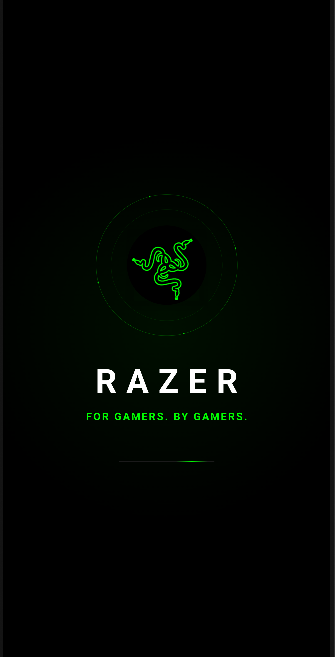
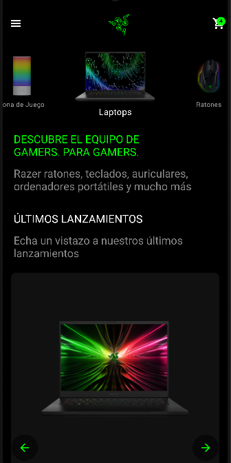
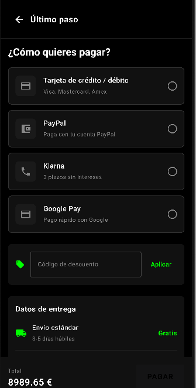

# AppRazer

Una app de e-commerce inspirada en la tienda oficial de Razer, hecha con Jetpack Compose

## Qué tiene

- **Autenticación completa**: email/contraseña y Google Sign-In con Firebase Auth, recuperación de
  contraseña, y manejo correcto de sesión (incluyendo el selector de cuentas de Google al cerrar
  sesión).
- **Catálogo de productos**: carruseles animados por categoría, con autoplay que se pausa cuando el
  usuario interactúa.
- **Carrito y checkout**: carrito sincronizado con Firestore en tiempo real, formulario de pago con
  detección automática de marca de tarjeta (Visa/Mastercard/Amex) y un flip 3D de la tarjeta cuando
  escribes el CVV.
- **Perfil de usuario**: historial de pedidos, estadísticas, cierre de sesión.
- **Splash screen animado**: logo con efecto de brillo, texto tipo "typewriter", y sonido
  sincronizado con la animación.
- **Navegación fluida**: transiciones personalizadas entre pantallas (slide, fade, scale) según el
  contexto de cada una.

## Stack técnico

- **Kotlin + Jetpack Compose** para toda la UI
- **MVVM** con `ViewModel` + `StateFlow` — la lógica de negocio vive separada de los composables
- **Hilt** para inyección de dependencias
- **Firebase**: Authentication, Firestore (carrito, pedidos, perfil)
- **Coroutines** para todo el trabajo asíncrono
- **Coil** para carga de imágenes
- **Accompanist Pager** para los carruseles

## Arquitectura

El proyecto sigue una separación por capas:
Cada pantalla sigue el mismo patrón: el `Composable` solo dibuja y observa un `StateFlow`, el
`ViewModel` decide qué hacer, y el `Repository` habla con Firebase. Nada de lógica de negocio metida
directo en la UI.

## Capturas

  
  
  

## Cómo correrlo

Este proyecto necesita un archivo `google-services.json` de Firebase que no está incluido por
seguridad.

1. Crea un proyecto en [Firebase Console](https://console.firebase.google.com)
2. Habilita Authentication (Email/Password + Google) y Firestore
3. Descarga tu `google-services.json`
4. Colócalo en `app/google-services.json`
5. Sync del proyecto en Android Studio y listo

## Notas

Este es un proyecto personal en desarrollo activo — sigo agregando features (tests, deep links,
notificaciones push, entre otras)

---

Hecho por [Sebastian Gavonel](https://github.com/SebasDevs)